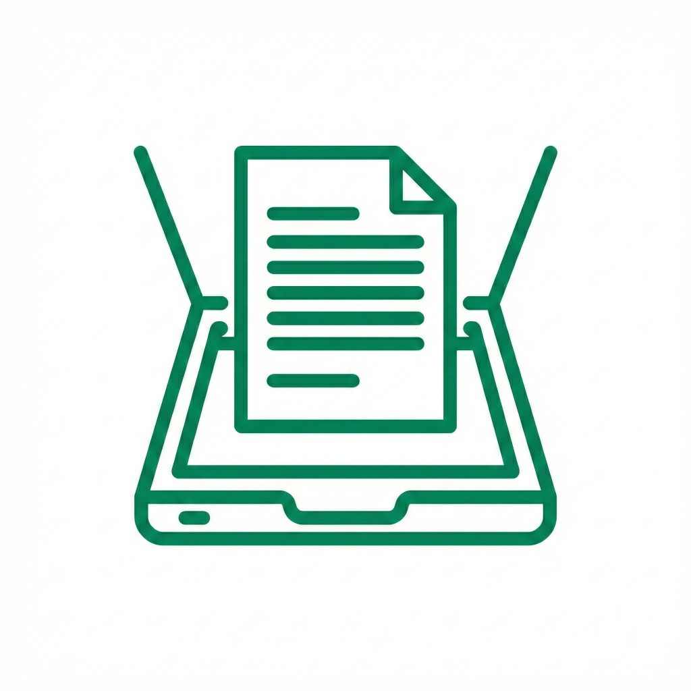

# DocScanner Plus

<p align="center">
  
</p>

A powerful document scanner app built with Flutter and Google ML Kit. Scan, organize, share, and extract text from your documents with ease.

## Features

- 📄 **Document Scanning** - High-quality scanning powered by Google ML Kit
- 📝 **OCR Text Extraction** - Extract text from scanned documents
- 📂 **Document Management** - Rename, delete, and organize your scans
- 📤 **Easy Sharing** - Share documents via any app
- 🔍 **Multi-Select** - Batch operations on multiple documents
- 💾 **Persistent Storage** - Documents saved locally and persist across sessions

## Screenshots

<!-- Add screenshots here -->

## Getting Started

### Prerequisites

- Flutter SDK ^3.10.7
- Android Studio or VS Code
- Android device/emulator (Android 21+)

### Installation

```bash
# Clone the repository
git clone https://github.com/yourusername/docscannerplus.git
cd docscannerplus

# Install dependencies
flutter pub get

# Run the app
flutter run
```

## Build

```bash
# Debug APK
flutter build apk --debug

# Release APK
flutter build apk --release

# App Bundle (for Play Store)
flutter build appbundle --release
```

## Tech Stack

- **Flutter** - Cross-platform UI framework
- **Google ML Kit Document Scanner** - Document scanning
- **Google ML Kit Text Recognition** - OCR functionality
- **SharedPreferences** - Local persistence
- **share_plus** - Document sharing

## Project Structure

```
lib/
├── main.dart                 # App entry point
├── home_page.dart            # Main UI with document grid
├── document_scanner_service.dart  # Scanner integration
├── models/
│   └── document_model.dart   # Document data model
├── repositories/
│   └── document_repository.dart  # Persistence layer
└── services/
    └── ocr_service.dart      # OCR functionality
```

## Contributing

1. Fork the repository
2. Create your feature branch (`git checkout -b feature/amazing-feature`)
3. Commit your changes (`git commit -m 'Add amazing feature'`)
4. Push to the branch (`git push origin feature/amazing-feature`)
5. Open a Pull Request

## License

This project is licensed under the MIT License - see the [LICENSE](LICENSE) file for details.

## Acknowledgments

- [Google ML Kit](https://developers.google.com/ml-kit) for document scanning and OCR
- [Flutter](https://flutter.dev) for the amazing framework
